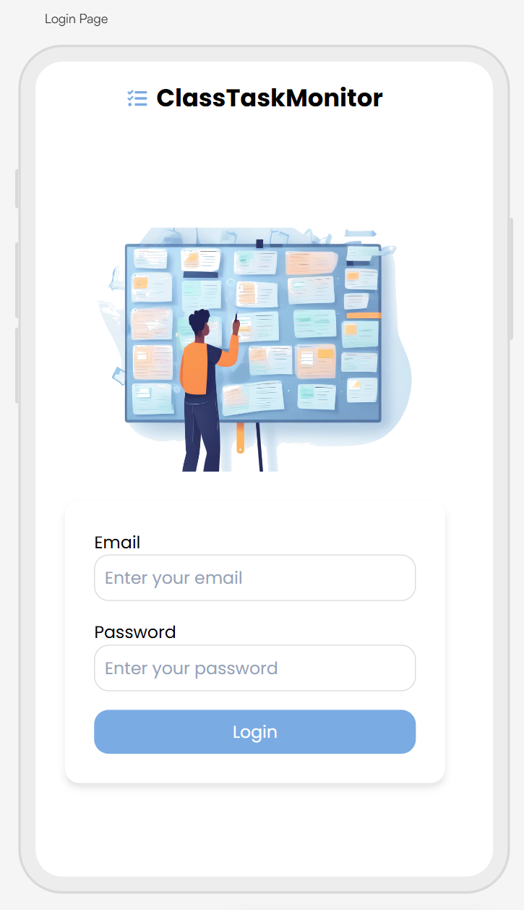
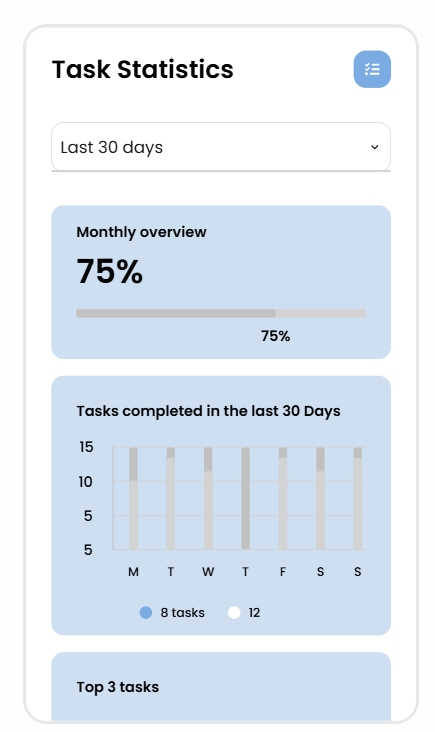
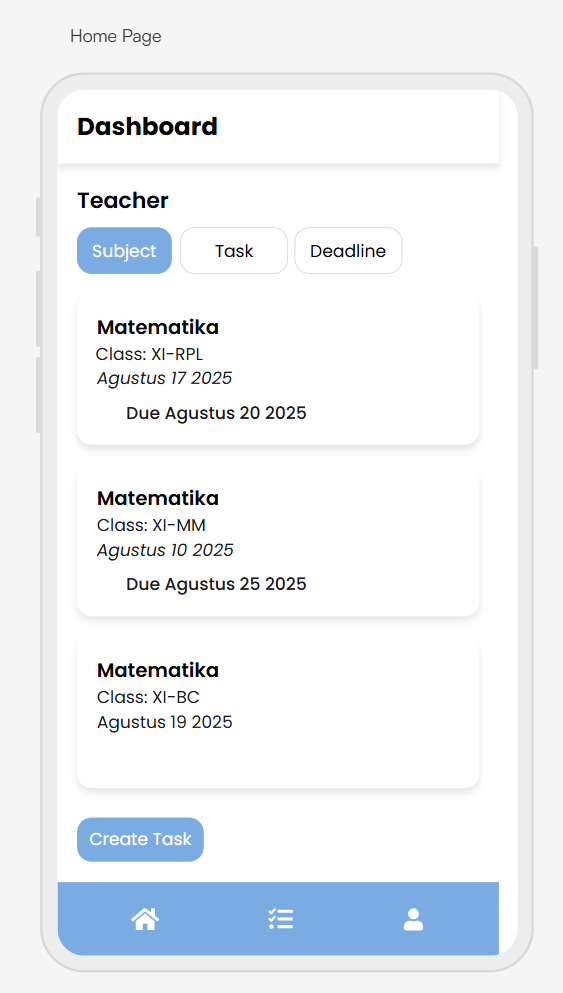
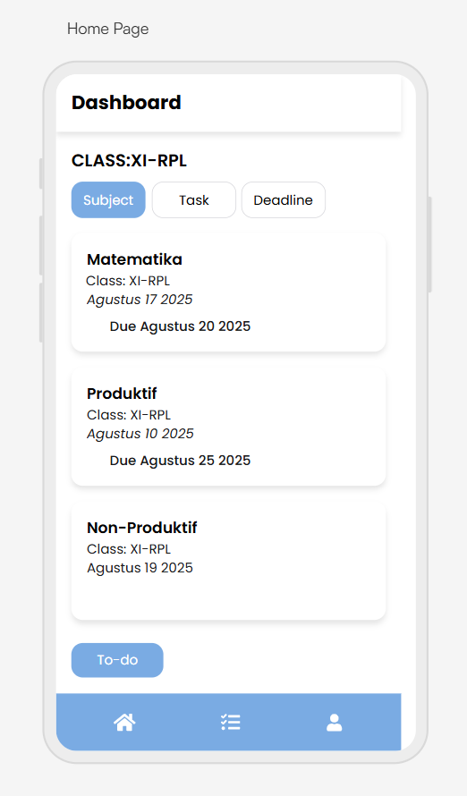

<h1 align="center">📚 Monitoring_Tugas (Seperti Classroom) </h1>

  <i>“Belajar lebih terarah, tugas lebih terpantau.”</i>

---

<h2 align="center">🔎 Apa itu Monitoring Tugas?</h2>

  <b> Monitoring Tugas adalah aplikasi berbasis website yang memudahkan guru dalam mengelola, 
  memantau, dan memberi penilaian terhadap tugas siswa. Sementara itu, siswa dapat dengan mudah 
  melihat daftar tugas, mengerjakannya, serta menerima umpan balik langsung dari guru. </b>

---

<h2 align="center">🎯 Tujuan Aplikasi</h2>

- Membantu guru agar lebih mudah memantau pengumpulan tugas.  
- Membantu siswa agar tidak ketinggalan deadline.  
- Meningkatkan komunikasi pembelajaran secara digital.  
- Menyediakan sistem rekap otomatis untuk laporan sekolah.  

---

<h2 align="center">⚡ Fitur Utama</h2>

👩‍💻 **Admin**  
- Mengelola data user (guru & murid)  
- Mengelola kelas & mata pelajaran  
- Membuat laporan rekap tugas  
- Melihat aktivitas guru dan murid  

👨‍🏫 **Guru**  
- Membuat tugas baru (judul, deskripsi, deadline)  
- Upload materi & soal  
- Memantau murid yang sudah/ belum mengumpulkan  
- Memberikan nilai & komentar feedback  
- Edit atau hapus tugas  

👩‍🎓 **Murid**  
- Melihat daftar tugas yang diberikan guru  
- Upload jawaban (file/link/teks)  
- Melihat status tugas (dikumpulkan, terlambat, dinilai)  
- Mendapat nilai & feedback dari guru  
- Mengakses materi pembelajaran  

---

<h2 align="center">📊 ERD – Monitoring Tugas</h2>

Lihat diagram lengkap di:  
https://dbdiagram.io/d/Monitoring-Tugas-xxxxxx  

atau lihat gambar diagram di bawah:

  

---

<h2 align="center">🌀 Flowchart – Monitoring Tugas</h2>

  

---

<h2 align="center">🎭 Use Case Diagram – Monitoring Tugas</h2>

| Admin | Guru & Murid | 
|------------|-----------------|
|  |  | 

---

<h2 align="center">📍 Activity Diagram – Monitoring Tugas</h2>

  

---

<h2 align="center">🖥️ Tampilan Aplikasi – Monitoring Tugas</h2>

| Login Page | Dashboard Admin | Dashboard Guru | Dashboard Murid |
|------------|-----------------|----------------|-----------------|
|  |  |  |  |

---

<h2 align="center">🚀 Future Features</h2>

- Notifikasi otomatis via email / WhatsApp  
- Integrasi dengan Google Drive / OneDrive  
- Forum diskusi antara guru & murid  
- Mode offline untuk akses materi tanpa internet  
